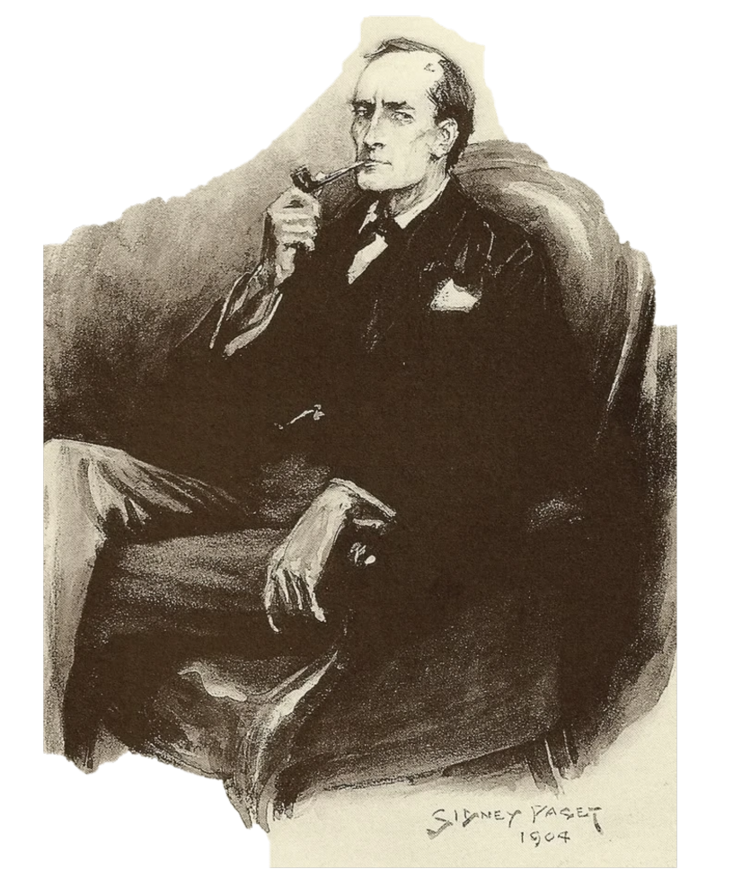
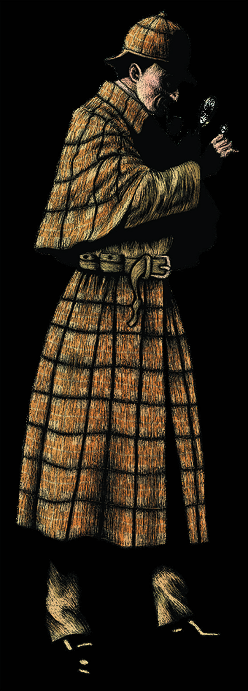
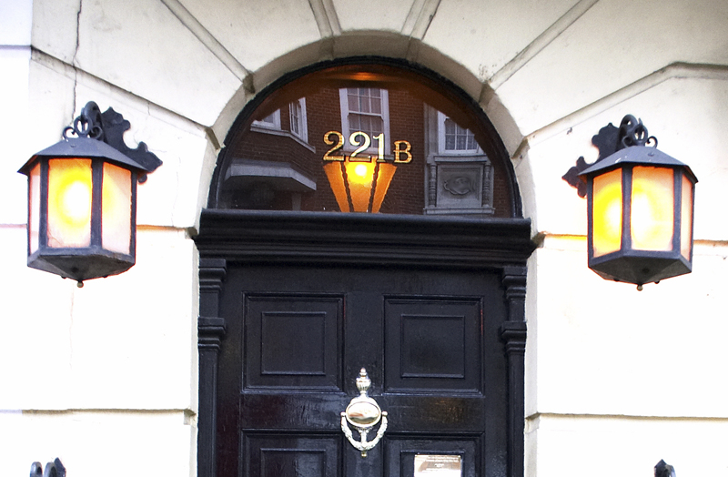
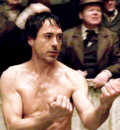
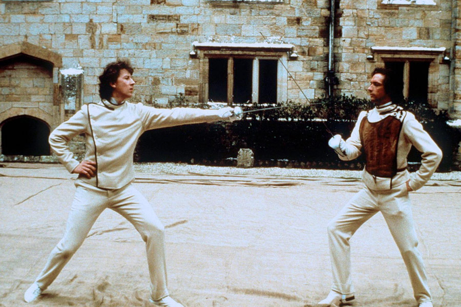
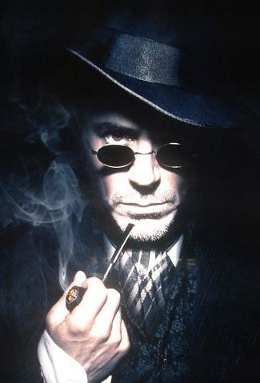
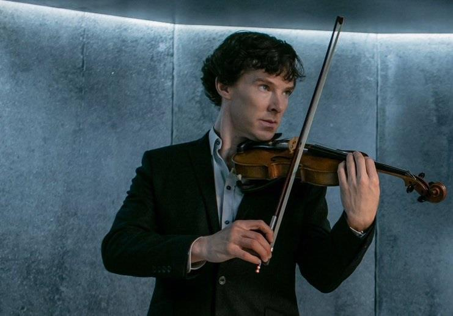
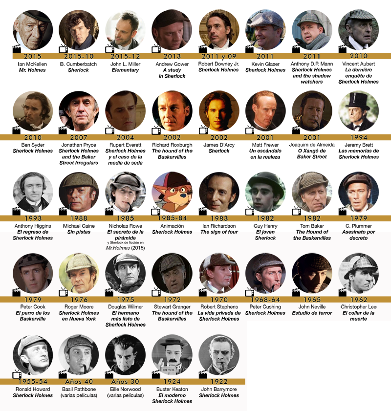

# <spam style="color:#A85B09">Sherlock Holmes</spam> 

V:

C'est un détective fictif créé par Sir Arthur Conan Doyle en 1887.

H:

## <spam style="color:#FF9E36">Description physique</spam> 

Holmes est grand, mince, a des yeux sombres et perçants, un nez aquilin, un menton prononcé et massif.

V:

## <spam style="color:#F58A1B">Personnalité</spam> 

Froide, ironique, pleine d'esprit et intellectuellement agitée

H:

## <spam style="color:#007CA8">La vie et les habitudes</spam> 

V: 

H:

## <spam style="color:#1BBBF5">Adaptations</spam>
